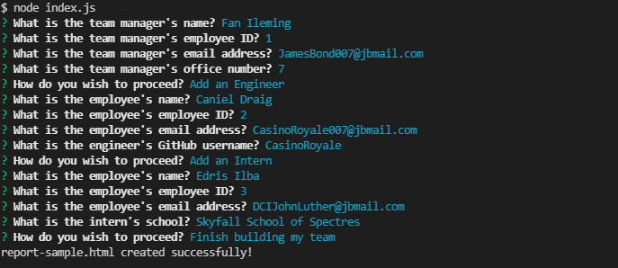
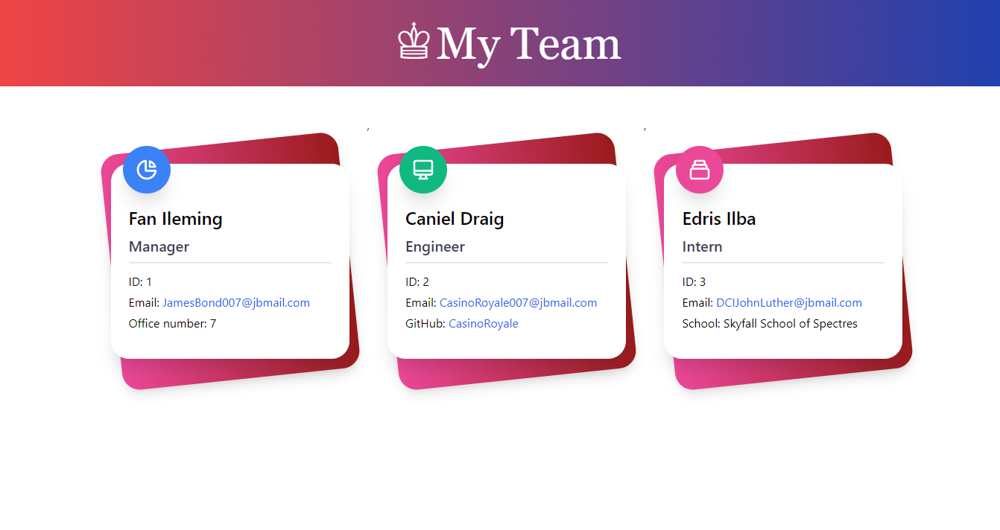

# Team Profile Generator
[](https://opensource.org/licenses/MIT)

## Description

An application that will dynamically generate a Team Profile HTML webpage for a software engineering team that displays summaries for each team member.

The application uses the inquirer, prettier and email-validator package modules.

## 📖Table of Contents
1. [Installation](#installation)
2. [Usage](#usage)
3. [Assets](#assets)
4. [Technologies](#Technologies)
5. [License](#license)
6. [Contributing](#contributing)
7. [Tests](#tests)
8. [Questions](#questions)

## Installation
1. To install this project:
    - Clone it through GitHub using the following code in the terminal: 
        ``` 
        git clone https://github.com/TrushilBudhia/Team-Profile-Generator.git
        ```
        or
    - Download the zip file; or
    - Fork it through GitHub

2. To add the dependencies to the project, navigate to the root directory for the project and run:
    ```js
    npm install
    ```
    
## Usage
1. To begin the application, navigate to the root directory for the project in your preferred terminal and run the following code:
    ```js
    node index.js
    ```
2. Once the prompts are all answered, the application will generate a report-sample.html file with the information provided

## Assets
The link to a guide video that demonstrates the applications functionality: [Guide Video](https://drive.google.com/file/d/1twYCIaWeegPdrW65UWJnXp0Vq1XxZOOF/view?usp=sharing)

The following images shows the functionality of the application and the generated html report once the application has processed the information received:





The following image shows the tests of the application having been run and passed:


## Technologies
- [Node.js](https://nodejs.org/en/docs/)
- [Inquirer](https://www.npmjs.com/package/inquirer)
- [Jest](https://www.npmjs.com/package/jest)
- [Prettier](https://prettier.io/)
- [email-validator](https://www.npmjs.com/package/email-validator)
- [Tailwind CSS](https://tailwindcss.com/) 
- JavaScript

## License
Copyright © 2021 [Trushil](https://github.com/TrushilBudhia)

This project is [MIT](./LICENSE) licensed

## Contributing
Contributions, issues and feature requests are welcome.

Feel free to check the [issues page](https://github.com/TrushilBudhia/Team-Profile-Generator/issues) if you want to contribute.

## Tests
The tests for the application can be run using the following code:
```js
npm test
```

## Questions
For any questions, please contact the author:

- Github: [@Trushil](https://github.com/TrushilBudhia)
- Email: trushil.budhia@gmail.com
